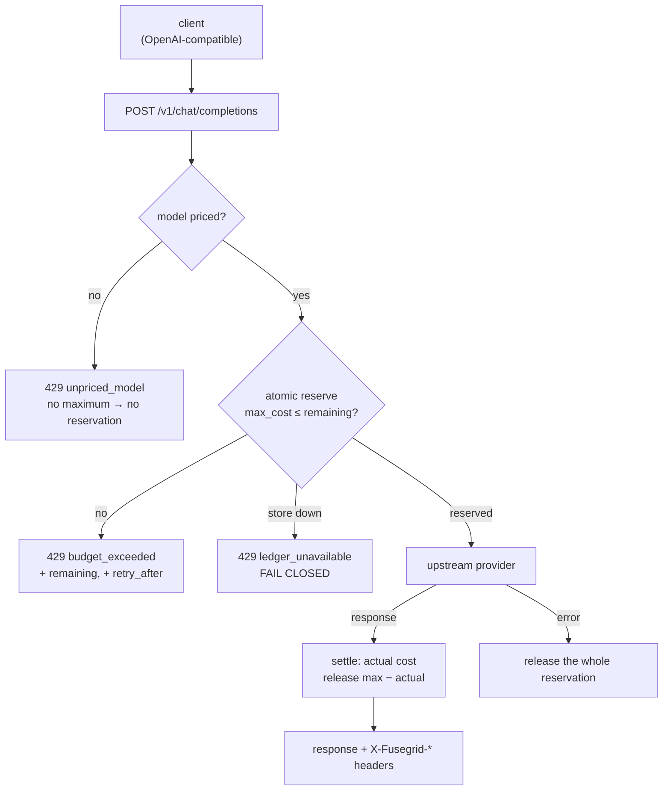

# 03 — Architecture

## The one idea

**Reserve before you spend; settle after you know.**

A request is admitted only if the *maximum possible* cost of that request fits inside
the remaining balance, reserved atomically. After the response, the reservation settles
to the actual cost and the difference is released.

Everything else here is plumbing.

## Diagram



## Why each denial exists

| Denial | Cause | Alternative rejected |
|---|---|---|
| `budget_exceeded` | Reservation exceeds remaining balance | Admit and warn — this is the bug being fixed |
| `unpriced_model` | Model has no configured max cost | Assume a default price. That is measured failure #4: it silently targets the newest models |
| `ledger_unavailable` | Reservation could not be persisted | Proceed anyway. That is measured failure #3, and it looks like resilience while removing the control entirely |

**Failing closed is the whole point.** A budget control that degrades to permissive
under load is not a control. This is the decision most likely to be argued with, so it
is stated in the thesis and the README rather than buried.

## Components

| Component | Responsibility | Criterion |
|---|---|---|
| `fusegrid/ledger.py` | Atomic reserve / settle / release. The invariant lives here. | 1, 6 |
| `fusegrid/pricing.py` | Model → max cost. Unknown means unknown, never zero. | 4 |
| `fusegrid/proxy.py` | OpenAI-compatible surface, streams upstream through | 2, 3 |
| `fusegrid/settle.py` | Parse usage from response or stream, settle exactly | 6 |
| `fusegrid/observability.py` | OTEL spans, Prometheus metrics, structured decisions | — |
| `bench/enforce/` | Replays the four baseline patterns against fusegrid | 1 |
| `bench/latency/` | Overhead vs passthrough, ≥5 runs | 3 |

## Data flow, one request

1. `POST /v1/chat/completions` arrives, API key identifies the budget.
2. `pricing.max_cost(model, max_tokens)` → the ceiling for *this* request. No entry →
   deny `unpriced_model`.
3. `ledger.reserve(key, amount)` — single atomic operation returning
   `(ok, reservation_id, remaining)`. Store unreachable → deny `ledger_unavailable`.
4. Not ok → `429` with `remaining` and `retry_after`.
5. Proxy upstream, streaming the response back unmodified.
6. Extract actual usage: from `usage` in a normal response, or from the final chunk of a
   stream.
7. `ledger.settle(reservation_id, actual)` — commits actual, releases the remainder.
8. Upstream error or client disconnect → `ledger.release(reservation_id)` in full.

## Decisions

| Decision | Chosen | Rejected | Why | What would change it |
|---|---|---|---|---|
| Enforcement point | **Before the upstream call** | After, as usage lands | Cost cannot be un-spent. Every measured failure traces to enforcing after the money is gone. | Nothing; this is the thesis. |
| Reservation amount | **Configured maximum for the request** | Estimate from prompt tokens | Estimation is a research problem with unbounded error. Reserving the max is exact and boring, which is right for money. | A published estimator with error bounds. |
| Unknown model | **Deny** | Default price; allow and log | Measured failure #4. A default price silently mis-enforces for exactly the newest models. | Never default silently; a config opt-in is acceptable. |
| Ledger failure | **Deny (fail closed)** | Proceed, record best-effort | Measured failure #3. Availability preserved, control removed. | A caller explicitly opting into fail-open, documented as unsafe. |
| Store | **Redis single-node `INCRBYFLOAT` in a Lua script** | Postgres row lock; in-process counter | Atomicity without a transaction round-trip; a script is one RTT. In-process breaks with more than one replica — the exact race in failure #1. | Multi-region enforcement with a measured need. |
| Protocol surface | **OpenAI-compatible HTTP** | Provider SDKs; gRPC | Every provider and gateway speaks it, so one shape covers the ecosystem and it drops in front of existing clients with a base-URL change. | — |
| Streaming | **Pass through untouched, settle on the final chunk** | Buffer to count tokens | Buffering destroys time-to-first-token, which is the main reason to stream. | — |
| Deploy shape | **Sidecar / standalone container** | Library | A library must be adopted per-service and can be bypassed. A sidecar cannot be bypassed by code that does not know it exists. | — |

## The invariant, stated precisely

At all times, for every budget key:

```
committed + Σ(open reservations) ≤ ceiling
```

Every test in `tests/adversarial/` exists to violate this. If it holds under
concurrency, variable cost, storage faults, client disconnects and duplicate settles,
the thesis holds.
